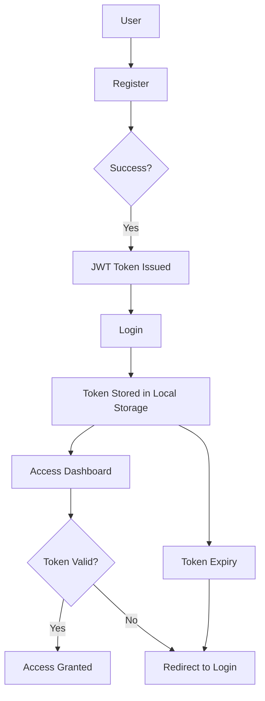

# Authentication-System

# JWT Authentication System (Django + React)

A full-stack authentication system built with **Django REST Framework**, **React-vite framework)**, and **MySQL**, using **JWT (JSON Web Tokens)** for secure user authentication.  

The system supports **user registration, login, protected dashboard routes**, and **auto logout when tokens expire**.

## 🚀 Features

- User Registration & Login
- JWT-based Authentication (access + refresh tokens)
- Protected Dashboard routes (only accessible when logged in)
- Auto logout on token expiration
- MySQL database integration
- Simple and clean React frontend with centralized login/register forms

## 🧩 Workflow / System Overview

### Explanation:
- User registers → server creates user and issues a JWT token.
- User logs in → server validates credentials and returns JWT token.
- Frontend stores token in Local Storage for subsequent requests.
- Access protected routes ( Dashboard) → token validity checked.
- Token expired or invalid → user is automatically logged out and redirected to login page.

### Technology Stack

| Layer            | Technologies / Tools                   |
|-----------------|---------------------------------------|
| **Frontend**    | React-vite, JSX, CSS               |
| **Backend**     | Django, Django REST Framework, MySQL   |
| **Authentication** | JWT (JSON Web Tokens), djangorestframework-simplejwt |
| **Dev Tools**   | Git, GitHub, VS Code                   |

### Interface Overview

 

*Figure: UI of Authentication System*

